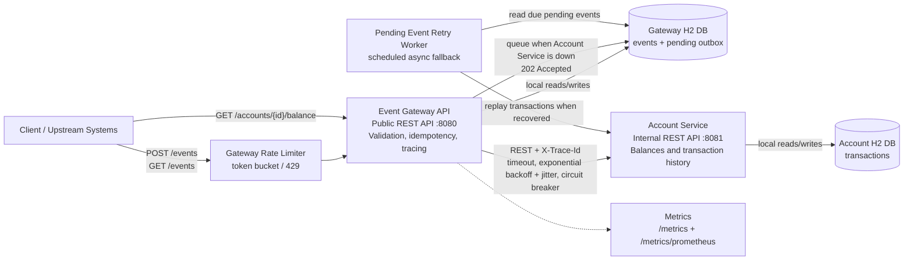

# Event Ledger

Event Ledger is a two-service Spring Boot system for accepting financial transaction events and applying them to account state. It is designed for duplicate delivery, out-of-order arrival, traceable service-to-service calls, and graceful behavior when the internal account service is unavailable.

## Architecture



The Event Gateway is the public-facing entry point. It validates incoming transaction events, stores accepted events in its own H2 database, enforces `eventId` idempotency, lists events in `eventTimestamp` order, and propagates `X-Trace-Id` to downstream calls.

The Account Service is an internal service called only by the Gateway. It stores applied transactions in its own H2 database, applies duplicate transactions idempotently, computes balance as `CREDIT - DEBIT`, and exposes account details to the Gateway.

The services are independently runnable processes and do not share database state. In Docker Compose, only the Gateway publishes a host port; the Account Service remains internal to the Compose network.

## Setup Instructions

Prerequisites:

- Java 21+
- Maven 3.9+
- Docker and Docker Compose, optional but recommended

Install dependencies and compile all modules:

```bash
mvn clean install -DskipTests
```

## Run With Docker Compose

```bash
docker compose up --build
```

Gateway:

```bash
curl http://localhost:8080/health
```

Account Service:

```bash
docker compose logs account-service
```

In Docker Compose, the Account Service is intentionally not published to the host. It is reachable by the Gateway on the Compose network at `http://account-service:8081`, which keeps the public API boundary aligned with the exercise requirement.

## Run Locally

Start the Account Service:

```bash
mvn -pl account-service -am spring-boot:run
```

Start the Gateway in a second terminal:

```bash
mvn -pl event-gateway -am spring-boot:run
```

Submit an event:

```bash
curl -i -X POST http://localhost:8080/events \
  -H 'Content-Type: application/json' \
  -H 'X-Trace-Id: demo-trace-001' \
  -d '{
    "eventId": "evt-001",
    "accountId": "acct-123",
    "type": "CREDIT",
    "amount": 150.00,
    "currency": "USD",
    "eventTimestamp": "2026-05-15T14:02:11Z",
    "metadata": {
      "source": "mainframe-batch",
      "batchId": "B-9042"
    }
  }'
```

Useful endpoints:

- `POST /events`
- `GET /events/{id}`
- `GET /events?account={accountId}`
- `GET /accounts/{accountId}/balance`
- `GET /accounts/{accountId}`
- `GET /health`
- `GET /metrics`
- `GET /metrics/prometheus`

The explicit Gateway and Account Service HTTP contracts are documented in [API_CONTRACT.md](API_CONTRACT.md).

## QA And Coverage

Run unit tests only:

```bash
mvn test
```

Run the complete automated test suite, including functional tests, real Gateway to Account Service flow, and both coverage report sets:

```bash
mvn clean verify
```

The build uses Surefire for unit tests and Failsafe for functional tests:

- Unit tests cover account balance math, repository-level duplicate event protection, event submission locking, circuit breaker behavior, the Gateway-to-Account consumer contract, and async fallback queue behavior.
- Functional tests cover Gateway and Account Service REST flows, an end-to-end Gateway to real Account Service transaction flow, idempotent duplicate submissions, out-of-order event listing, validation failures, trace propagation, concurrent duplicate failure handling, and graceful Gateway behavior when Account Service is unavailable.

Coverage reports are generated as HTML:

- `account-service/target/site/jacoco-unit/index.html`
- `event-gateway/target/site/jacoco-unit/index.html`
- `account-service/target/site/jacoco-functional/index.html`
- `event-gateway/target/site/jacoco-functional/index.html`

JaCoCo CSV files are emitted next to each HTML report for machine-readable coverage review.

## Resiliency Choice

The Gateway uses timeout + retry with exponential backoff and jitter, plus a small circuit breaker around Account Service calls. Timeout and retry prevent slow or transient failures from hanging client requests. Exponential backoff with jitter avoids synchronized retry bursts when the Account Service is struggling. The circuit breaker opens after repeated failures so balance and account-detail proxy calls can fail fast with `503 Service Unavailable`.

The Gateway serializes submission processing per `eventId`, then claims that `eventId` in its local store before calling the Account Service. That makes the Gateway the source of truth for event identity and prevents concurrent duplicate submissions from racing into inconsistent Gateway and Account records. If the Account Service is unavailable, the Gateway stores the event in a local pending outbox, returns `202 Accepted`, and a scheduled retry worker applies the transaction when the Account Service recovers.

`GET /events/{id}` and `GET /events?account=...` read only from the Gateway database, so they continue working during Account Service outages. Balance and account-detail queries return a clear `503` when the Account Service cannot be reached.

The Gateway also applies a configurable token-bucket rate limiter at the edge. The default configuration allows short bursts while protecting the service from sustained request spikes; excess requests return `429 Too Many Requests`.

## Observability

Both services emit JSON log lines with:

- `timestamp`
- `level`
- `service`
- `traceId`
- request metadata such as method, path, status, and duration

The Gateway creates a trace ID for each incoming request when the client does not provide `X-Trace-Id`. The same header is propagated to the Account Service and returned in responses.

Both services expose `GET /health`, which returns service status, active database connectivity, and basic diagnostics such as row counts.

Both services expose `GET /metrics`, which returns request and error counts by endpoint template. The Gateway also exposes `GET /metrics/prometheus` for Prometheus-compatible scraping.

This project keeps trace propagation lightweight with `X-Trace-Id` and structured logs. OpenTelemetry Collector plus Jaeger or Zipkin would be a natural next production step, but was not added to avoid turning the exercise into an infrastructure-heavy deployment.

## API Contract

`POST /events` accepts:

```json
{
  "eventId": "evt-001",
  "accountId": "acct-123",
  "type": "CREDIT",
  "amount": 150.00,
  "currency": "USD",
  "eventTimestamp": "2026-05-15T14:02:11Z",
  "metadata": {
    "source": "mainframe-batch"
  }
}
```

New events return `201 Created` when Account Service is available. If Account Service is unavailable, the Gateway stores the event locally for retry and returns `202 Accepted`. Duplicate `eventId` submissions return `200 OK` with the original event and `"duplicate": true`; the account balance is not changed again.
