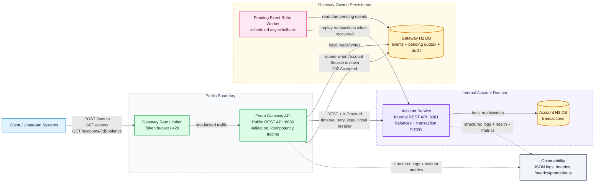

# AI-Augmented Event Ledger

AI-Augmented Event Ledger is a two-service Spring Boot system for accepting financial transaction events and applying them to account state. It is designed for duplicate delivery, out-of-order arrival, traceable service-to-service calls, graceful behavior when the internal account service is unavailable, and explicit evidence of AI-assisted engineering practices across design, development, and QA.

This folder is a separate application built from the stable Event Ledger baseline. The original working solution remains untouched at the repository root.

## Reviewer Path

Start here if you are evaluating the project:

1. Read the SDLC traceability map: [AI_ASSISTED_SDLC.md](AI_ASSISTED_SDLC.md).
2. Run the full local quality path:

```bash
./scripts/run-quality-gates.sh
```

3. Launch the complete application:

```bash
docker compose up --build
```

4. Open the React operations console at `http://localhost:3000`.
5. Review the agent playbooks in [agents](agents), prompt templates in [prompts](prompts), ADRs in [docs/adr](docs/adr), and generated evidence in [docs/generated](docs/generated).

For a step-by-step reviewer checklist, see [REVIEWER_PATH.md](REVIEWER_PATH.md).

## AI-Assisted SDLC Deliverables

The submission includes explicit agent-style deliverables to show how AI-assisted engineering practices were applied throughout the SDLC:

| Area | Deliverable | Location |
|---|---|---|
| Design Agent | Design document, architecture decisions, runtime/degraded-flow diagrams, production evolution notes | [docs/DESIGN_AGENT.md](docs/DESIGN_AGENT.md) |
| Development Agent | Error handling, logging, resiliency, auditing, and commit strategy notes | [docs/DEVELOPMENT_AGENT.md](docs/DEVELOPMENT_AGENT.md) |
| QA Agent | Unit/functional test strategy, coverage report locations, acceptance criteria | [docs/QA_AGENT.md](docs/QA_AGENT.md) |
| Agent Playbooks | Repeatable Design, Development, QA, Review, and Release agent workflows | [agents](agents) |
| Prompt Templates | Architecture, API contract, test generation, security/resiliency, and documentation prompts | [prompts](prompts) |
| ADRs | Architecture decision records for service separation, idempotency, resiliency, and AI-assisted SDLC | [docs/adr](docs/adr) |
| Automation | Quality gates, coverage summary, API contract validation, and demo-flow scripts | [scripts](scripts) |
| CI | Backend build, React build, unit/functional tests, coverage artifacts, and Docker Compose validation | [.github/workflows/ai-augmented-event-ledger-ci.yml](../.github/workflows/ai-augmented-event-ledger-ci.yml) |

## Architecture



The Event Gateway is the public-facing entry point. It validates incoming transaction events, stores accepted events in its own H2 database, enforces `eventId` idempotency, lists events in `eventTimestamp` order, records Gateway-owned audit entries, and propagates `X-Trace-Id` to downstream calls.

The AI-augmented version records audit entries for accepted events, duplicate submissions, successful Account Service application, and queued retry outcomes. Audit history is available through `GET /events/{eventId}/audit`.

The Account Service is an internal service called only by the Gateway. It stores applied transactions in its own H2 database, applies duplicate transactions idempotently, computes balance as `CREDIT - DEBIT`, and exposes account details to the Gateway.

The services are independently runnable processes and do not share database state. In Docker Compose, only the Gateway publishes a host port; the Account Service remains internal to the Compose network.

## Setup Instructions

Prerequisites:

- Java 21+
- Maven 3.9+
- Node.js 20+ and npm, only needed for local frontend development
- Docker and Docker Compose, optional but recommended

Install dependencies and compile all modules:

```bash
mvn clean install -DskipTests
```

## Run With Docker Compose

```bash
docker compose up --build
```

Gateway:

```bash
curl http://localhost:8080/health
```

React UI:

```bash
open http://localhost:3000
```

Account Service:

```bash
docker compose logs account-service
```

In Docker Compose, the Account Service is intentionally not published to the host. It is reachable by the Gateway on the Compose network at `http://account-service:8081`, which keeps the public API boundary aligned with the exercise requirement.

## Run Locally

Start the Account Service:

```bash
mvn -pl account-service -am spring-boot:run
```

Start the Gateway in a second terminal:

```bash
mvn -pl event-gateway -am spring-boot:run
```

Start the React UI in a third terminal:

```bash
cd frontend
npm install
npm run dev
```

The local React dev server runs at `http://localhost:5173` and proxies `/api` requests to the Gateway at `http://localhost:8080`.

Submit an event:

```bash
curl -i -X POST http://localhost:8080/events \
  -H 'Content-Type: application/json' \
  -H 'X-Trace-Id: demo-trace-001' \
  -d '{
    "eventId": "evt-001",
    "accountId": "acct-123",
    "type": "CREDIT",
    "amount": 150.00,
    "currency": "USD",
    "eventTimestamp": "2026-05-15T14:02:11Z",
    "metadata": {
      "source": "mainframe-batch",
      "batchId": "B-9042"
    }
  }'
```

Useful endpoints:

- `POST /events`
- `GET /events/{id}`
- `GET /events/{id}/audit`
- `GET /events?account={accountId}`
- `GET /accounts/{accountId}/balance`
- `GET /accounts/{accountId}`
- `GET /health`
- `GET /metrics`
- `GET /metrics/prometheus`

The explicit Gateway and Account Service HTTP contracts are documented in [API_CONTRACT.md](API_CONTRACT.md).

## React Operations Console

The `frontend` module is a React/Vite operations console built on top of the existing Gateway APIs. It includes:

- Event submission with metadata JSON and trace ID propagation
- Chronological event listing by account
- Event detail and audit trail lookup
- Balance and account transaction lookup
- Gateway health diagnostics
- Request/error metrics visualization

The UI uses `/api` as its default API base. Docker serves the compiled React app through nginx and proxies `/api` to the `event-gateway` service. Local Vite development uses the same `/api` path and proxies to `localhost:8080`.

## QA And Coverage

Run unit tests only:

```bash
mvn test
```

Run the complete automated test suite, including functional tests, real Gateway to Account Service flow, and both coverage report sets:

```bash
mvn clean verify
```

Run the full reviewer-oriented quality gate:

```bash
./scripts/run-quality-gates.sh
```

Additional automation:

- `./scripts/validate-api-contract.sh` checks documented API contract references against controller mappings.
- `./scripts/generate-coverage-summary.sh` emits a concise markdown summary from JaCoCo CSV reports.
- `./scripts/demo-flow.sh` submits an event, reads ledger/audit data, checks balance, and verifies health endpoints against a running Gateway.

The build uses Surefire for unit tests and Failsafe for functional tests:

- Unit tests cover account balance math, repository-level duplicate event protection, event submission locking, circuit breaker behavior, the Gateway-to-Account consumer contract, and async fallback queue behavior.
- Functional tests cover Gateway and Account Service REST flows, an end-to-end Gateway to real Account Service transaction flow, idempotent duplicate submissions, out-of-order event listing, validation failures, trace propagation, audit lifecycle entries, concurrent duplicate failure handling, and graceful Gateway behavior when Account Service is unavailable.

Coverage reports are generated as HTML:

- `account-service/target/site/jacoco-unit/index.html`
- `event-gateway/target/site/jacoco-unit/index.html`
- `account-service/target/site/jacoco-functional/index.html`
- `event-gateway/target/site/jacoco-functional/index.html`

JaCoCo CSV files are emitted next to each HTML report for machine-readable coverage review.

## Resiliency Choice

The Gateway uses timeout + retry with exponential backoff and jitter, plus a small circuit breaker around Account Service calls. Timeout and retry prevent slow or transient failures from hanging client requests. Exponential backoff with jitter avoids synchronized retry bursts when the Account Service is struggling. The circuit breaker opens after repeated failures so balance and account-detail proxy calls can fail fast with `503 Service Unavailable`.

The Gateway serializes submission processing per `eventId`, then claims that `eventId` in its local store before calling the Account Service. That makes the Gateway the source of truth for event identity and prevents concurrent duplicate submissions from racing into inconsistent Gateway and Account records. If the Account Service is unavailable, the Gateway stores the event in a local pending outbox, returns `202 Accepted`, and a scheduled retry worker applies the transaction when the Account Service recovers.

`GET /events/{id}` and `GET /events?account=...` read only from the Gateway database, so they continue working during Account Service outages. Balance and account-detail queries return a clear `503` when the Account Service cannot be reached.

The Gateway also applies a configurable token-bucket rate limiter at the edge. The default configuration allows short bursts while protecting the service from sustained request spikes; excess requests return `429 Too Many Requests`.

## High-Volume And Low-Latency Readiness

This implementation is intentionally scoped to the assignment constraints, but the design choices were made with high-volume financial event ingestion in mind. The Gateway performs deterministic validation and idempotency checks before downstream calls, persists accepted events locally, isolates Account Service failures with timeout, retry, jitter, and circuit breaker behavior, and uses a pending outbox so transaction events are not lost when the internal service is unavailable. Reads for event history stay local to the Gateway, which keeps ledger lookups available even during Account Service degradation.

For the exercise, both services use embedded H2 databases to keep the solution easy to run and review. In a production high-throughput environment, the same service boundaries would be retained while replacing the embedded stores with independently owned production databases, such as PostgreSQL or Aurora, with indexes and partitioning around `accountId`, `eventId`, and `eventTimestamp`. The Gateway idempotency table would be backed by a durable unique constraint and, if needed, accelerated with Redis for hot-key duplicate detection and distributed rate limiting.

The current synchronous REST path is appropriate for the requested architecture and provides simple request-level traceability. For ultra-low-latency and very high-volume ingestion, the next evolution would introduce Kafka, Pulsar, or another durable streaming layer between event acceptance and account projection. In that model, `POST /events` would acknowledge after validation, idempotency claim, and durable enqueue; Account Service consumers would process events asynchronously by account partition, preserving per-account ordering while scaling horizontally. This would reduce client-facing latency and decouple ingestion throughput from account projection throughput.

The implementation already includes several patterns that support this evolution:

- Gateway-owned event ledger and Account-owned transaction state, avoiding shared database coupling.
- Idempotent event and transaction handling, which is required for at-least-once delivery.
- Out-of-order-safe balance calculation based on transaction sums instead of arrival order.
- Local outbox and retry worker, which mirrors the production outbox/streaming pattern at exercise scale.
- Trace propagation, structured logs, health checks, and metrics hooks for operational visibility.
- Rate limiting and circuit breaking to protect the system under spikes or downstream failures.

Before claiming production-grade high-volume, ultra-low-latency readiness, I would add load tests with explicit SLOs, production persistence, distributed idempotency/rate limiting, container orchestration autoscaling, real OpenTelemetry tracing with Jaeger or Zipkin, Prometheus/Grafana alerting, database migration tooling, and capacity testing for hot-account scenarios. The current implementation is therefore production-minded and architecturally prepared for scale, while deliberately keeping infrastructure lightweight for reviewability.

## Observability

Both services emit JSON log lines with:

- `timestamp`
- `level`
- `service`
- `traceId`
- request metadata such as method, path, status, and duration

The Gateway creates a trace ID for each incoming request when the client does not provide `X-Trace-Id`. The same header is propagated to the Account Service and returned in responses.

Both services expose `GET /health`, which returns service status, active database connectivity, and basic diagnostics such as row counts.

Both services expose `GET /metrics`, which returns request and error counts by endpoint template. The Gateway also exposes `GET /metrics/prometheus` for Prometheus-compatible scraping.

This project keeps trace propagation lightweight with `X-Trace-Id` and structured logs. OpenTelemetry Collector plus Jaeger or Zipkin would be a natural next production step, but was not added to avoid turning the exercise into an infrastructure-heavy deployment.

## API Contract

`POST /events` accepts:

```json
{
  "eventId": "evt-001",
  "accountId": "acct-123",
  "type": "CREDIT",
  "amount": 150.00,
  "currency": "USD",
  "eventTimestamp": "2026-05-15T14:02:11Z",
  "metadata": {
    "source": "mainframe-batch"
  }
}
```

New events return `201 Created` when Account Service is available. If Account Service is unavailable, the Gateway stores the event locally for retry and returns `202 Accepted`. Duplicate `eventId` submissions return `200 OK` with the original event and `"duplicate": true`; the account balance is not changed again.
