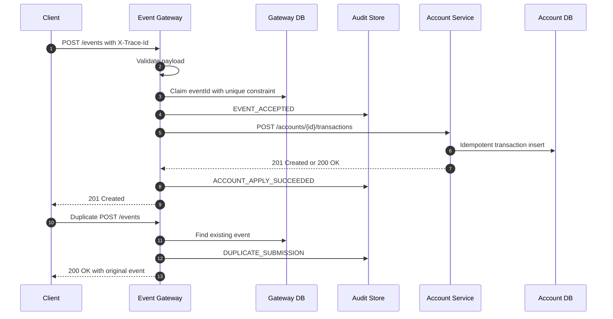
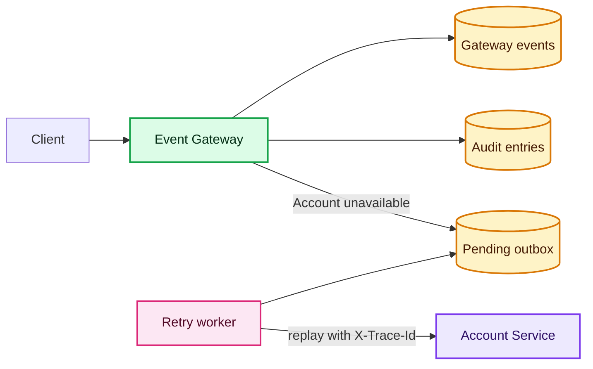

# Design Agent Deliverable

## Objective

The Design Agent was used to accelerate architecture discovery, identify distributed-systems risks, and convert the assignment requirements into a reviewable implementation blueprint. The result is a two-service Event Ledger system with explicit service ownership, idempotent event handling, out-of-order tolerance, resiliency, traceability, and auditability.

## Architecture Decisions

| Decision | Rationale |
|---|---|
| Separate Gateway and Account Service processes | Preserves service autonomy and avoids shared in-process state. |
| Separate H2 databases per service | Satisfies the assignment constraint while demonstrating database ownership. |
| Gateway-owned event ledger | The public API boundary owns event identity, validation, and event history. |
| Account-owned transaction state | Balance and account history remain internal account-domain concerns. |
| Synchronous REST for service-to-service calls | Matches the assignment while keeping contracts simple and testable. |
| Gateway local outbox for Account Service outages | Provides graceful degradation and a clear path to production outbox/streaming patterns. |
| Trace ID propagation with JSON logs | Gives evaluators a visible request path across services without requiring heavy infrastructure. |
| Audit trail at the Gateway boundary | Captures important event lifecycle decisions for support, compliance review, and debugging. |

## Runtime Flow

## Degraded Flow

## Production Evolution

The exercise uses embedded storage and synchronous REST to keep the solution runnable and reviewable. For production high-volume use, the Design Agent identified the following evolution path:

- Replace H2 with independently owned production databases and migration tooling.
- Add Kafka or Pulsar between event acceptance and account projection.
- Partition processing by `accountId` to preserve per-account ordering while scaling horizontally.
- Use Redis for distributed rate limiting and hot-key idempotency acceleration.
- Add OpenTelemetry Collector plus Jaeger or Zipkin for full trace visualization.
- Add Prometheus/Grafana dashboards and alerting for latency, error rate, circuit state, and outbox backlog.
